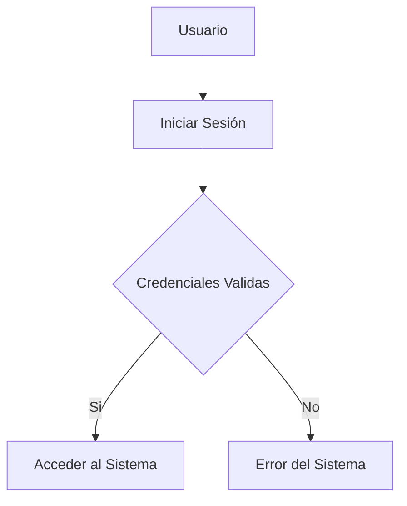

## Indice
- [Titulo](#titulo-importante)
- [Funciones](#funciones)
- [Tablas](#creando-tablas)
- [Diagrama](#mermaid-diagramas)
- [DiagramaTecsup](#tecsup-diagramas)

## Titulo Importante
Me encuentro aprendiendo *Markdown* en las clasess del profesor Luis Pallin. .

## Subtitulo 01
Aqui verificamos como formatear diferentes **tipos de texto**
## Subtitulo 02
Podremos conoccer diferentes tipos de formatos de textos usando ~~Markdown~~. 

## Creando Hiperv....
[Google](https://www.google.com)
[Tecsup](https://www.tecsup.edu.pe)

## Colocar Imagenes


## Funciones
- [X] Registrar Alumno
- [X] Generar Matricula
- [ ] Campo Vacio
- [ ] Libre

## Creando Tablas

| Lenguaje de Programación | Creador |
| ------------------------ | --------|
| Java |James Cosling |
| PHP  |Rasmus Lerdor |
| Python  | Guido Van Rossum |

## Codigo

```html
<h1>Hola Mundo</h1>
``` 
```css
 body{
    background: "red";
    
 }
 ```

 ```java
 public class Main {
    public static void main(String[] args) 
    { System.out.println("Hola Mundo Java"); }
}
 ```

 ```javascript
 let nombre = "Mundo";

console.log("Hola, " + nombre + "!");
```

## Mermaid Diagramas



## TECSUP DIAGRAMAS

```mermaid
flowchart TD
A[TECSUP] --> B[Carreras disponibles en el sitio academico]
B --> C[Diseño]
B --> D[Administracion]
B --> E[Informatica]
B --> F[Mecanica]
